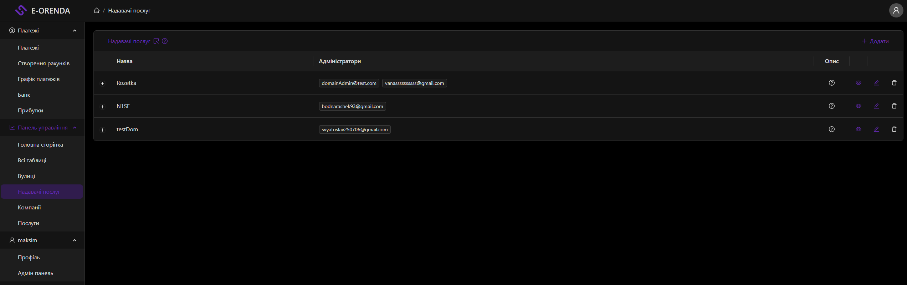
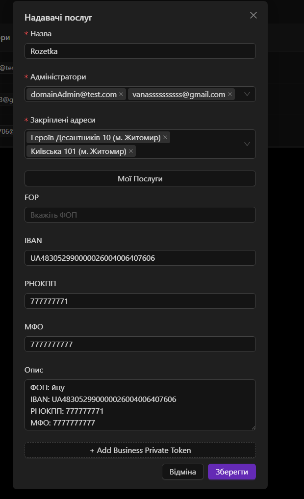

# Domain (Надавачі послуг)

Сторінка для управління надавачами послуг — організаціями які здійснюють управління та мають під собою компанії та об'єкти нерухомості.

## Сторінка
- **Роут:** `/domain`
- **Файл:** [DomainsBlock](/common\components\DashboardPage\blocks\domains.tsx)
- **Таблиця:** [DomainsTable](/common\components\Tables\Domains\Table.tsx)
- **Хедер:** [DomainsHeader](/common\components\Tables\Domains\Header.tsx)

## Вигляд сторінки

## Компоненти
- `DomainsBlock` — головний блок сторінки
- `DomainsHeader` — хедер з кнопкою додавання
- `DomainsTable` — таблиця надавачів послуг з розгортанням вулиць
- `DomainModal` — модалка додавання/редагування надавача послуг
- `DomainForm` — форма модалки з усіма полями
- `DomainInfo` — поля ФОП, IBAN, РНОКПП, МФО, токени банку
- `DomainStreets` — вибір закріплених адрес
- `DomainsServices` — управління групами послуг домену
- `StreetsBlock` — блок вулиць

## DomainModal
- **Опис:** Модальне вікно для додавання та редагування надавача послуг.
- **Файл:** [DomainModal](/common\components\UI\DomainsComponents\DomainModal\index.tsx)
- **Вигляд модалки:** 

### Поля форми
| Поле | Опис |
|------|------|
| `name` | Назва надавача послуг |
| `adminEmails` | Email адміністраторів |
| `streets` | Закріплені адреси |
| `description` | Опис (автозаповнюється з ФОП, IBAN, РНОКПП, МФО) |
| `IEName` | ФОП |
| `iban` | IBAN |
| `rnokpp` | РНОКПП |
| `mfo` | МФО |
| `domainBankToken` | Токени банку |
| `customServices` | Групи послуг |

## DomainsServices
Управління групами послуг через Transfer компонент.
- Можна створювати групи послуг
- Можна додавати кастомні послуги
- `GLOBAL_ADMIN` може видаляти послуги

## Ролі доступу
| Роль | Доступ |
|------|--------|
| `GLOBAL_ADMIN` | Повний доступ — перегляд, додавання, редагування, видалення, видалення послуг |
| `DOMAIN_ADMIN` | Бачить тільки свої домени, може додавати та редагувати |
| `USER` | Немає доступу |

## API endpoints

| Метод | URL | Опис |
|-------|-----|------|
| `GET` | `/api/domain` | Отримати всі домени |
| `GET` | `/api/domain/:id` | Отримати домен по id |
| `GET` | `/api/domain/admin` | Отримати домени адміна |
| `GET` | `/api/domain/areas/:domainId` | Отримати площі домену |
| `POST` | `/api/domain` | Створити домен |
| `PATCH` | `/api/domain/:id` | Редагувати домен |
| `DELETE` | `/api/domain/:id` | Видалити домен |

## RTK Query хуки

| Хук | Опис |
|-----|------|
| `useGetDomainsQuery` | Отримати всі домени |
| `useGetDomainByPkQuery` | Отримати домен по id |
| `useGetDomainsByAdminQuery` | Отримати домени адміна |
| `useGetAreasQuery` | Отримати площі домену |
| `useAddDomainMutation` | Додати домен |
| `useEditDomainMutation` | Редагувати домен |
| `useDeleteDomainMutation` | Видалити домен |
| `useGetCurrentUserQuery` | Поточний юзер |
| `useGetAllStreetsQuery` | Отримати всі вулиці для вибору адрес |
| `useGetCustomServicesQuery` | Отримати кастомні послуги |
| `useCreateCustomServiceMutation` | Створити кастомну послугу |
| `useDeleteCustomServiceMutation` | Видалити кастомну послугу |

## API файли
- [domain.api.ts](/common/api/domainApi/domain.api.ts)
- [domain.api.types.ts](/common/api/domainApi/domain.api.types.ts)

## API Route
- [pages/api/domain/index.ts](/pages/api/domain/index.ts)