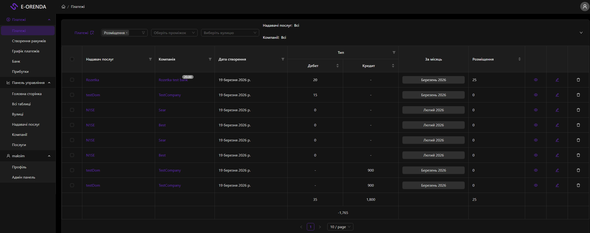
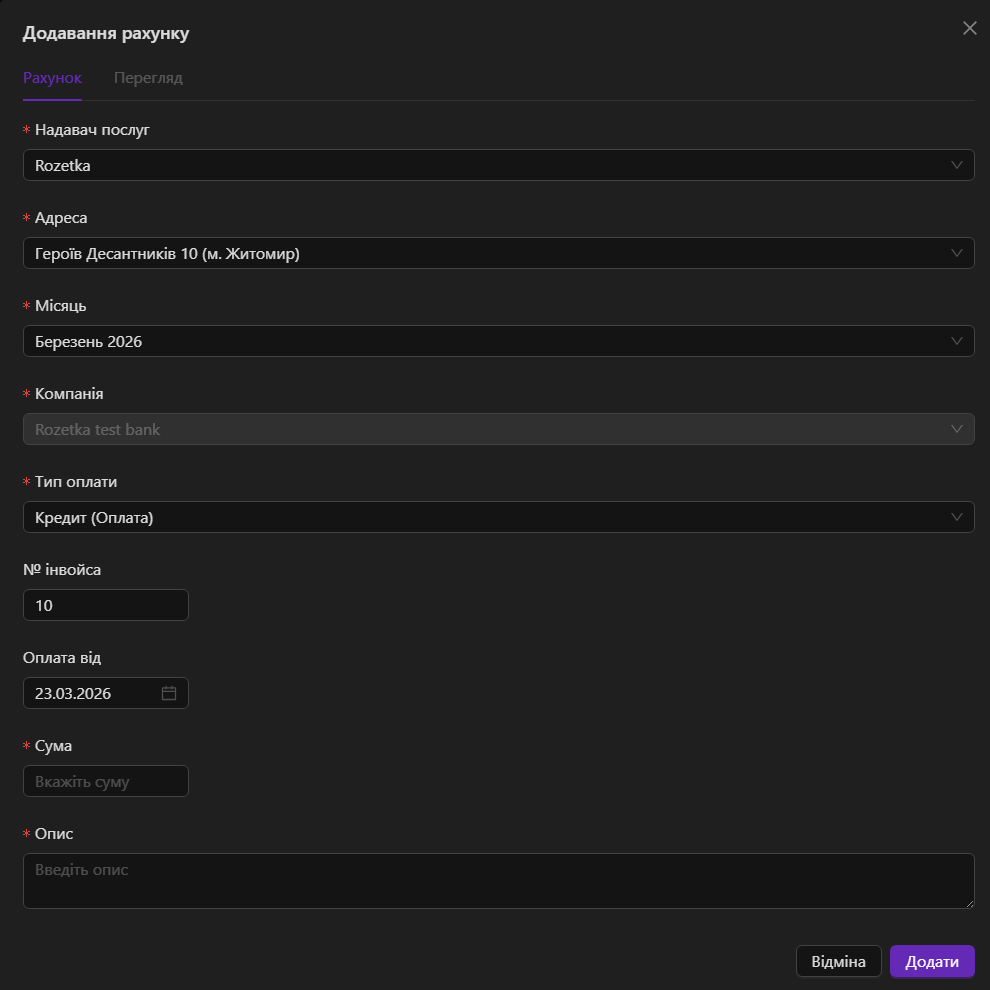

# Payments

The Payments page is designed for managing financial operations, including creating, viewing, editing, and analyzing invoices (payments) between companies and service providers.

## Page
- **Route:** `/payments`
- **File:** [PaymentsBlock](/common/components/DashboardPage/blocks/payments.tsx)
- **Page Table:** [PaymentsTable](/common/components/Tables/Payment/Table.tsx)
- **Page Header:** [PaymentsHeader](/common/components/Tables/Payment/Header.tsx)

## Page View

## Components
- `PaymentsBlock` — main page container
- `PaymentsHeader` — main page header
- `PaymentCardHeader` — header with filters and actions
- `PaymentsTable` — payments table
- `AddPaymentModal` — modal for adding/editing/viewing

## AddPaymentModal
- **Description:** Modal window for creating, editing, and viewing a payment.
- **File:** [AddPaymentModal](/common/components/AddPaymentModal/index.tsx)
- **Modal View:**

## Redux
- **Slice:** `payments`
- **File:** [modules/store/paymentsSlice.ts](/modules/store/paymentsSlice.ts)
- **Actions:**
  - `setPage` — pagination
  - `setFilters` — table filters
  - `setDomainsFilter` — domains filter
  - `setCompaniesFilter` — companies filter
  - `setStreetsFilter` — streets filter
  - `setDateFilters` — date filters
  - `setOpenView` — open view mode
  - `setOpenEdit` — open edit mode
  - `setCloseModal` — close modal
  - `setDebtorCompanies` — debtor companies
  - `setSelectedColumns` — selected columns
  - `setPaymentsDeleteItems` — items for deletion
  - `setSelectedPayments` — selected payments
  - `setSelectedDateField` — selected date field for filtering

## API endpoints

| Method | URL | Description |
|--------|-----|------------|
| GET | `/api/spacehub/payment` | Get all payments |
| GET | `/api/spacehub/payment/:id` | Get payment by id |
| POST | `/api/spacehub/payment` | Create payment |
| PATCH | `/api/spacehub/payment/:id` | Edit payment |
| DELETE | `/api/spacehub/payment/:id` | Delete payment |
| DELETE | `/api/spacehub/payment/multiple` | Delete multiple payments |
| POST | `/api/spacehub/payment/generatePdf` | Generate PDF |
| POST | `/api/spacehub/payment/generateExcel` | Generate Excel |
| GET | `/api/spacehub/payment/:id/change-log` | Get payment changelog |
| POST | `/api/spacehub/payment/:id/change-log` | Create changelog |

## RTK Query hooks

| Hook | Description |
|------|------------|
| `useGetAllPaymentsQuery` | Get all payments with filters |
| `useGetPaymentQuery` | Get a single payment |
| `useAddPaymentMutation` | Add payment |
| `useEditPaymentMutation` | Edit payment |
| `useDeletePaymentMutation` | Delete payment |
| `useDeleteMultiplePaymentsMutation` | Delete multiple payments |
| `useGeneratePdfMutation` | Generate PDF |
| `useGenerateExcelMutation` | Generate Excel |
| `useGetPaymentChangeLogsQuery` | Get changelog |
| `useCreatePaymentChangeLogMutation` | Create changelog |
| `useGetDomainFiltersQuery` | Domain filters |
| `useGetRealEstateFiltersQuery` | Company filters |
| `useGetAddressFiltersQuery` | Address filters |
| `useGetDateFiltersQuery` | Date filters |
| `useGetCurrentUserQuery` | Current user |
| `useGetDebtorsQuery` | Debtors |

## API

- [payment.api.ts](/common/api/paymentApi/payment.api.ts)
- [payment.api.types.ts](/common/api/paymentApi/payment.api.types.ts)

## API Route

- [pages/api/spacehub/payment/index.ts](/pages/api/spacehub/payment/index.ts)