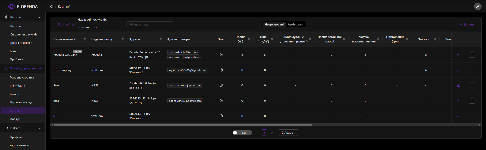
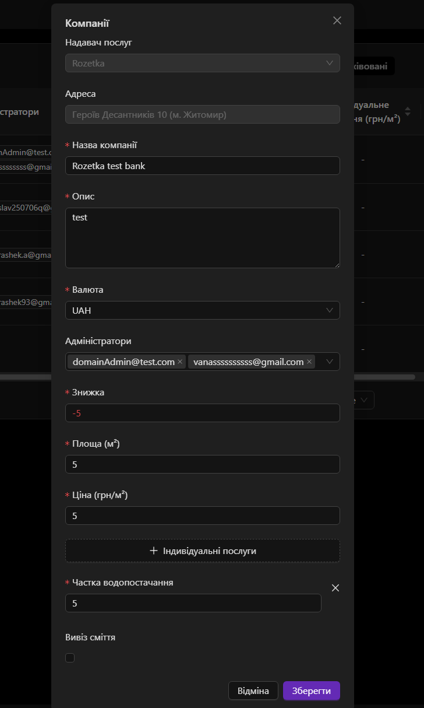

# RealEstate (Companies)

A page for managing companies — real estate entities that belong to service providers.

## Page
- **Route:** `/real-estate`
- **File:** [RealEstateBlock](/common/components/DashboardPage/blocks/realEstates.tsx)
- **Table:** [CompaniesTable](/common/components/Tables/Companies/Table.tsx)
- **Header:** [CompaniesHeader](/common/components/Tables/Companies/Header.tsx)

## Page View

## Components
- `RealEstateBlock` — main page container
- `CompaniesHeader` — header with filters and add button
- `CompaniesTable` — companies table
- `RealEstateModal` — modal for adding/editing a company
- `RealEstateForm` — modal form with all fields
- `RealEstateCardHeader` — dashboard card header
- `CustomServicesCard` — custom services card
- `DomainsSelect` — service provider selector
- `AddressesSelect` — address selector

## RealEstateModal (modal)
- **Description:** Modal window for creating and editing a company.
- **File:** [RealEstateModal](/common/components/UI/RealEstateComponents/RealEstateModal/index.tsx)
- **Modal View:**

### Form Fields
| Field | Description |
|------|------------|
| `domain` | Service provider |
| `street` | Address |
| `companyName` | Company name |
| `description` | Description |
| `adminEmails` | Admin emails |
| `currency` | Currency (UAH, USD, EUR) |
| `discount` | Discount |
| `totalArea` | Area (m²) |
| `pricePerMeter` | Price (UAH/m²) |
| `garbageCollector` | Garbage collection |
| `inflicion` | Inflation index |
| `customServices` | Custom services |
| `archived` | Archived |

## Access Roles
| Role | Access |
|------|--------|
| `GLOBAL_ADMIN` | Full access |
| `DOMAIN_ADMIN` | Can see companies of their domain, can add and edit |
| `USER` | Can see only their companies |

## API endpoints

| Method | URL | Description |
|--------|-----|------------|
| `GET` | `/api/real-estate` | Get all companies |
| `POST` | `/api/real-estate` | Create company |
| `PATCH` | `/api/real-estate/:id` | Edit company |
| `DELETE` | `/api/real-estate/:id` | Delete company |
| `PATCH` | `/api/archived/:id` | Archive company |

## RTK Query hooks

| Hook | Description |
|------|------------|
| `useGetAllRealEstateQuery` | Get all companies |
| `useAddRealEstateMutation` | Add company |
| `useEditRealEstateMutation` | Edit company |
| `useDeleteRealEstateMutation` | Delete company |
| `useUpdateArchivedItemMutation` | Archive company |
| `useGetDomainByPkQuery` | Get domain by id |
| `useGetAllServicesQuery` | Get domain services |
| `useGetCustomServicesQuery` | Get custom services |
| `useGetCustomServicesByDomainQuery` | Get domain custom services |
| `useGetCurrentUserQuery` | Current user |

## API files
- [realestate.api.ts](/common/api/realestateApi/realestate.api.ts)
- [realestate.api.types.ts](/common/api/realestateApi/realestate.api.types.ts)

## API Route
- [pages/api/real-estate/index.ts](/pages/api/real-estate/index.ts)