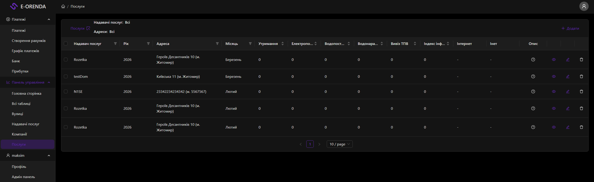
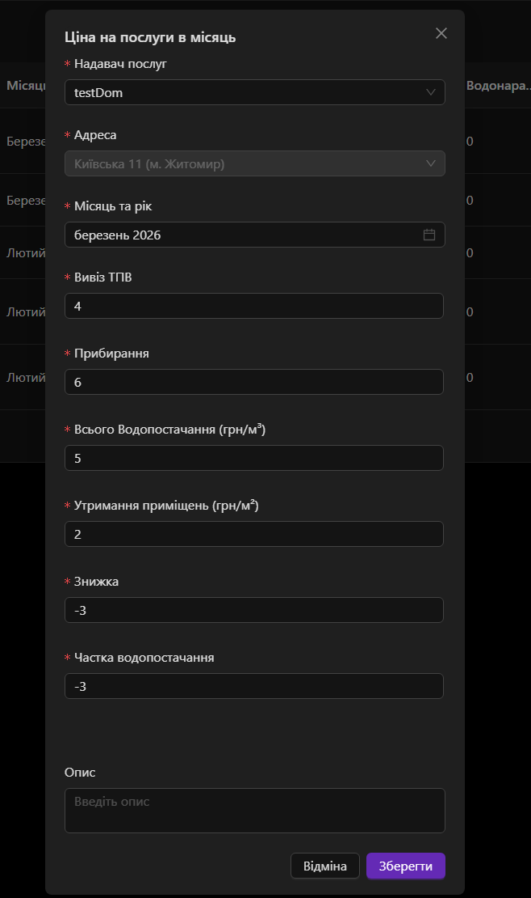

# Services

The Services page is designed for managing services — monthly data about utility payments for companies.

## Page
- **Route:** `/service`
- **File:** [ServicesBlock](/common/components/DashboardPage/blocks/services.tsx)
- **Table:** [ServicesTable](/common/components/Tables/Services/Table.tsx)
- **Header:** [ServicesHeader](/common/components/Tables/Services/Header.tsx)

## Page View

## Components
- `ServicesBlock` — main page container
- `ServicesHeader` — header with filters and add button
- `ServicesTable` — services table with filters
- `AddServiceModal` — modal for adding/editing a service
- `AddServiceForm` — form for adding and editing
- `PreviewServiceForm` — form for view only
- `ServiceCardHeader` — dashboard card header
- `DomainFilterTags` — service provider filter tags
- `StreetFilterTags` — street filter tags
- `ModalDelete` — delete confirmation modal

## Modal View
- **Description:** Modal window for creating, editing, and viewing a monthly service.
- **File:** [AddServiceModal](/common/components/AddServiceModal/index.tsx)
- **Modal View:**

## Access Roles
| Role | Access |
|------|--------|
| `GLOBAL_ADMIN` | Full access |
| `DOMAIN_ADMIN` | Can see services of their domain, can add and edit |
| `USER` | Can see only services of their companies |

## API endpoints

| Method | URL | Description |
|--------|-----|------------|
| `GET` | `/api/service` | Get all services |
| `GET` | `/api/service/address` | Get service addresses |
| `POST` | `/api/service` | Create service |
| `PATCH` | `/api/service/:id` | Edit service |
| `DELETE` | `/api/service/:id` | Delete service |

## RTK Query hooks

| Hook | Description |
|------|------------|
| `useGetAllServicesQuery` | Get all services |
| `useGetServicesAddressQuery` | Get service addresses |
| `useAddServiceMutation` | Add service |
| `useEditServiceMutation` | Edit service |
| `useDeleteServiceMutation` | Delete service |
| `useGetCurrentUserQuery` | Current user |
| `useGetCustomServicesQuery` | Get custom services |
| `useGetDomainFiltersQuery` | Domain filters |
| `useGetAddressFiltersQuery` | Address filters |
| `useGetDateFiltersQuery` | Date filters |

## API files
- [service.api.ts](/common/api/serviceApi/service.api.ts)
- [service.api.types.ts](/common/api/serviceApi/service.api.types.ts)

## API Route
- [pages/api/service/index.ts](/pages/api/service/index.ts)