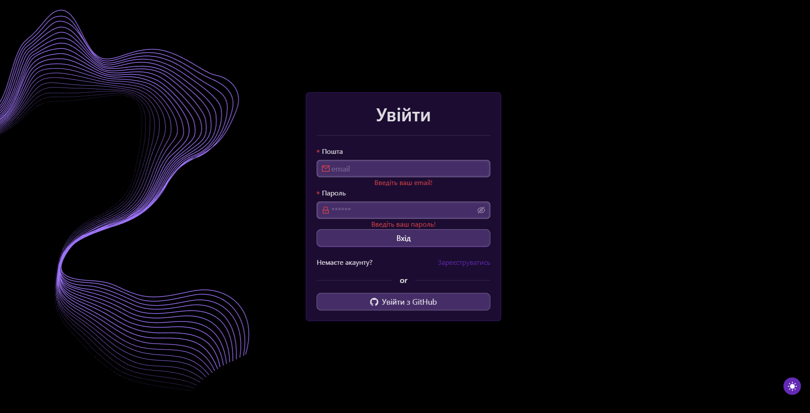

# Authentication Flow

**Description**: The entry point to the system. Handles user identification, secure session creation via NextAuth, registration of new accounts, and access protection for private routes.

## Flow Steps

### 1. Landing Page (Entry Point)
*   **URL**: `/`
*   **Component**: `HomePage` / `DashboardLanding`
*   **Visual Experience**:
    *   **Background**: A dynamic "Wave" Lottie animation (`/animations/WaveForBG.json`) rotates and loops in the background.
    *   **Interactive Elements**: A `SplashCursor` component adds a fluid visual effect following the mouse pointer.
    *   **Hero Section**: Displays the "E-ORENDA" welcome title and a descriptive text about property management services.
    *   **3D/Lottie Visuals**: A secondary Lottie animation (`/animations/AnimationCity.json`) depicts a city/building theme to reinforce the real estate context.

*   **User Actions**:
    1.  **"Увійти" (Sign In)** Button:
        *   **Action**: Clicks the primary button.
        *   **Outcome**: Router pushes to `/auth/signin`.
    2.  **"Зв’яжіться з нами" (Contact Us)** Button:
        *   **Action**: Clicks the ghost button.
        *   **Outcome**: Router pushes to `/contacts` for support or inquiries.

### 2. Session Validation (Protected Routes)
*   **Mechanism**: The application uses `NextAuth` (v4) for session management.
*   **Client-Side**: The `useSession()` hook checks if a user token is present in the browser (cookies/localStorage).
*   **Middleware/Guard**:
    *   If a user attempts to access private pages (e.g., `/dashboard`, `/payment`) without a session:
    *   **Redirect**: The system automatically redirects to `/auth/signin`.
    *   **Callback URL**: The original destination is often preserved to redirect back after successful login.

### 3. Sign In (Login)
*   **URL**: `/auth/signin`
*   **UI Elements**:
    *   **Email Field**: Validates email format.
    *   **Password Field**: Masked input.
    *   **Submit Button**: Triggers the authentication flow.
    *   **Navigation Links**: Options to switch to "Sign Up" or "Forgot Password".
*   **Process**:
    1.  User enters credentials.
    2.  Frontend calls `signIn('credentials', { email, password })` from `next-auth/react`.
    3.  **Backend Verification**:
        *   The NextAuth API route (`/api/auth/[...nextauth]`) receives the request.
        *   It queries the MongoDB database for the user.
        *   It compares the hashed password.
*   **Outcomes**:
    *   **Success**:
        *   A session token (JWT) is issued.
        *   The user is redirected to the **Dashboard** (`/`).
        *   Global state (Redux/Context) is updated with the user profile, including `roles` (e.g., `GLOBAL_ADMIN`, `DOMAIN_ADMIN`, `USER`) and `domainId`.
    *   **Failure**:
        *   The user remains on the login page.
        *   An error notification (Toast/Alert) displays: "Invalid email or password" or "User not found".

### 4. Sign Up (Registration)
*   **URL**: `/auth/signup`
*   **Form Data**:
    *   **Name**: Full display name.
    *   **Email**: Unique identifier.
    *   **Password**: User's secret.
*   **Submission Flow**:
    1.  User fills the form and clicks "Register".
    2.  Frontend sends a `POST` request to `/api/auth/sign-up`.
    3.  **Backend Processing**:
        *   Checks if the email already exists in the `User` collection.
        *   Hashes the password (e.g., using bcrypt).
        *   Creates a new User document with default role (usually `USER`).
*   **Post-Registration**:
    *   **Success**: Returns `201 Created`. The user is redirected to Sign In or automatically logged in (depending on implementation).
    *   **Error**: Returns `400` if the user already exists.

### 5. Sign Out
*   **Action**: User clicks "Logout" in the Profile menu or Sidebar.
*   **Process**: Calls `signOut()` from NextAuth.
*   **Outcome**: Session cookies are cleared, and the user is redirected back to the Landing Page or Sign In page.

---

## Visual Reference

