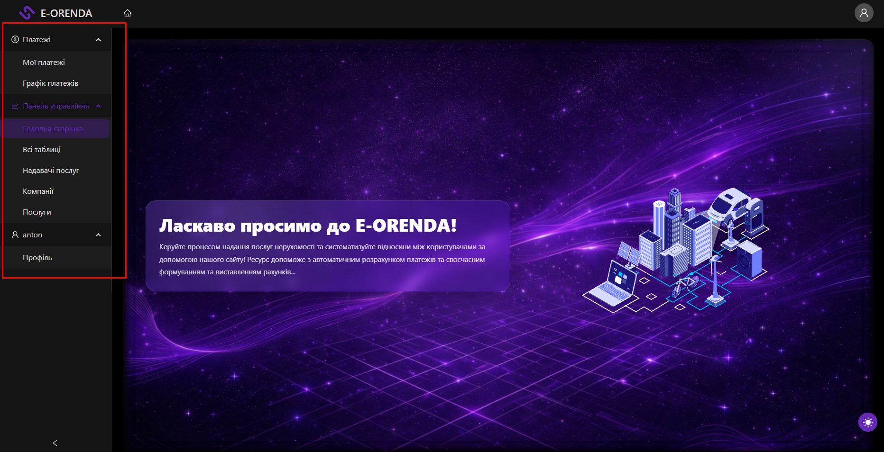

# Dashboard & Navigation

**Description**: The central hub of the application (`/`). It provides high-level metrics, navigation to all core modules via a sidebar menu, and features an interactive onboarding tour for new users.

## 1. Layout & Structure

Upon successful login, the user enters the Dashboard Layout, which consists of:

- **Sidebar (Navigation Menu)**: Located on the left (or top on mobile), implementing the `Ant Design` Menu component.
- **Header**: Contains the User Avatar (profile access) and global actions.
- **Main Content Area**: Displays the dashboard widgets or the content of the selected module.

## 2. Navigation Modules (Menu)

The navigation items are rendered based on the user's role. Detailed descriptions below correspond to the tooltips used in the system.

### Core Modules (Available to All)

1.  **Payments** (`/payment`)
    - _Label_: "Платежі"
    - _Description_: "Сторінка для виставлення рахунку компанії за послуги в місяць."
    - _Function_: Access to the billing, invoice generation, and payment history module.

2.  **Companies (Real Estate)** (`/real-estate`)
    - _Label_: "Компанії"
    - _Description_: "Сторінка компаній, для перегляду інформації про компанію користувача."
    - _Function_: Management of tenants, buildings, and physical objects.

3.  **Service Providers (Domains)** (`/domain`)
    - _Label_: "Надавачі послуг"
    - _Description_: "Сторінка для перегляду інформації про домен який надає ряд особистих послуг."
    - _Function_: Configuration of the service provider entities (the organizations issuing invoices).

4.  **Services** (`/service`)
    - _Label_: "Послуги"
    - _Description_: "Сторінка для виставлення цін за послуги в місяць."
    - _Function_: Setting up tariffs (Rent, Electricity, Water) for specific months.

5.  **Profile** (`/profile`)
    - _Label_: "Профіль"
    - _Description_: "Перегляд особистої інформації про себе."
    - _Function_: User settings, password management, and contact info.

### Admin-Only Modules

Visible only if `isAdminCheck(userRoles)` returns `true` (Roles: `GLOBAL_ADMIN`, `DOMAIN_ADMIN`).

6.  **Bank** (`/bank`)
    - _Label_: "Банк"
    - _Description_: "Сторінка для перегляду вхідних платежів до особистого рахунку у банку."
    - _Function_: Bank reconciliation and transaction monitoring.

7.  **Profits** (`/profit`)
    - _Label_: "Прибутки"
    - _Description_: "Сторінка для перегляду та контролю втрат/прибутків за місяць."
    - _Function_: Financial analytics and balance sheets.

## 3. Onboarding Tour Logic

The application includes an automated guide (`DashboardTour`) built with `antd.Tour`.

### Trigger Mechanism

- **Check**: On load, the component checks `localStorage` for a key: `dashboardTourSeen_${user.email}`.
- **Auto-Start**: If the key is missing, a timer starts, and the tour launches automatically after **1.2 seconds**.
- **Completion**: Once finished or closed, the flag is saved to `localStorage` to prevent re-running.
- **Manual Start**: Can be triggered manually via a help button (`isManualStart={true}`).

### Tour Steps Sequence

1.  **Payments**: Highlights the "Платежі" menu item.
    - _Text_: "Сторінка для виставлення рахунку компанії за послуги в місяць".
2.  **Companies**: Highlights "Компанії".
    - _Text_: "Сторінка компаній, для перегляду інформації про компанію користувача".
3.  **Service Providers**: Highlights "Надавачі послуг".
    - _Text_: "Сторінка для перегляду інформації про домен який надає ряд особистих послуг".
4.  **Services**: Highlights "Послуги".
    - _Text_: "Сторінка для виставлення цін за послуги в місяць".
5.  **Profile (Menu)**: Highlights the sidebar "Профіль" link.
6.  **Profile (Avatar)**: Highlights the User Avatar in the header.
    - _Text_: "Також можна перейти в профіль."
7.  **Bank** (Admin only): Highlights "Банк".
8.  **Profits** (Admin only): Highlights "Прибутки".

## 4. Dashboard Widgets

The main area displays summary cards and actionable widgets:

- **Active Tasks**:
  - Displays tasks with status `OPEN` or `IN_PROGRESS`.
  - Allows quick navigation to task details.
- **Financial Overview** (Admins):
  - **Profits Widget**: Visualizes income trends.
  - **Balance**: Shows current domain balance calculated via `/api/profits/balance/[domainId]`.
- **Quick Actions**:
  - Shortcuts to create new Payments or Tasks directly.

---

## Visual Reference

> 
