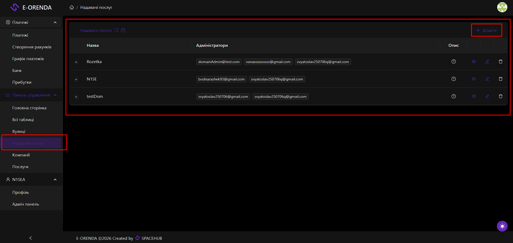
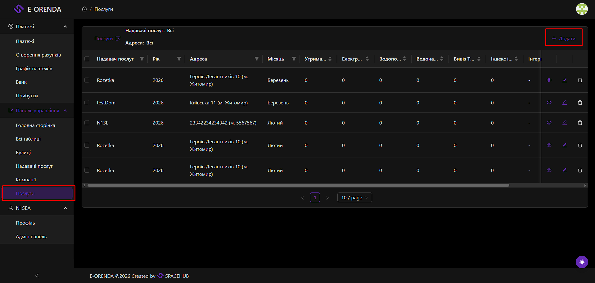

# Data Setup: Entities Configuration

**Description**: Before any billing or task management can occur, the system's "static" data must be populated. This involves defining who provides services (Domains), who receives them (Real Estate), and how much they cost (Services).

## 1. Create Domain (Service Provider)
*   **Location**: `/domain` page.
*   **Action**: Click the **Add** button (visible to Admins).
*   **Fields**:
    *   **Name**: The official name of the Service Provider organization.
    *   **Currency**: The default currency for invoices (e.g., UAH, USD).
    *   **Bank Details**: IBAN, Bank Name, SWIFT code (for generating invoices).
    *   **Admin Contacts**: Email addresses for notifications.
    *   **Description/Footer**: Text to appear on the bottom of invoices (Signatures area).

## 2. Create Real Estate (Tenants/Objects)
*   **Location**: `/real-estate` page.
*   **Action**: Click **Add**.
*   **Fields**:
    *   **Company Name**: Name of the tenant or object.
    *   **Domain**: Select the parent Service Provider.
    *   **Address/Street**: Link to a specific physical location.
    *   **Description**: Additional details about the tenant (e.g., Director's name for contracts).
    *   **Bank Details**: Tenant's billing information.

## 3. Configure Services (Tariffs)
*   **Location**: `/service` page.
*   **Action**: Click **Add** to create a tariff plan for a specific month.
*   **Key Fields**:
    *   **Provider (Domain)**: Select who is charging.
    *   **Month/Year**: The billing period (e.g., "January 2026").
    *   **Rent Price**: Cost per square meter/unit.
    *   **Electricity Price**: Cost per kW.
    *   **Water Price**: Cost per cubic meter.
    *   **Garbage Collection**: Fixed cost or per unit.
    *   **Inflation Index**: Adjustment percentage if applicable.
    *   **Description**: Notes visible on the invoice.

> **Note**: Creating a Service record essentially sets the "Price List" for a specific month. Payments created in that month will pull these values automatically.

---

## Visual Reference

> 

> 