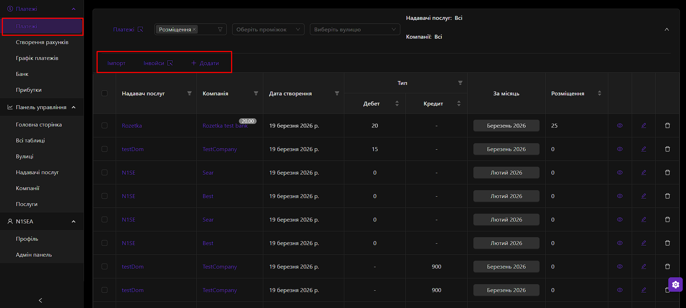

# Monthly Billing Cycle

**Actor**: Property Manager / Accountant.
**Goal**: To generate a monthly debit record (invoice data) for a specific tenant based on fixed tariffs and variable meter readings.
**Prerequisites**:

1.  A **Domain** (Service Provider) has been created.
2.  A **Real Estate** object (Tenant/Company) has been created and linked to the Domain.
3.  A **Service** (Tariff sheet) for the target billing month has been configured.

---

### 1. Initiate Payment

- **Navigation**: The user navigates to the **Payments** module via the main menu (`/payment`).
- **Action**: The user clicks the **"Add Payment"** button, typically styled with a `<PlusOutlined />` icon.
- **UI Response**: A modal window or a dedicated form page appears, ready for data entry. The form is initially disabled until the billing context is selected.

### 2. Context Selection (Cascading Dropdowns)

The user must define the "who, where, and when" of the bill. Each selection filters the options for the next, ensuring data integrity.

1.  **Select Domain**: The user chooses the Service Provider from a dropdown list.
    - _API Interaction_: The dropdown is populated by a call to `GET /api/domain/admin`.

2.  **Select Street**: After selecting a Domain, this dropdown is populated with associated streets.
    - _API Interaction_: `GET /api/filter/street?domainId=[selected_domain_id]`.

3.  **Select Month**: The user picks the billing month and year from a date picker (e.g., "March 2026").

4.  **Select Company**: Finally, the user selects the specific tenant company.
    - _API Interaction_: `GET /api/filter/real-estate?domainId=...&streetId=...`.

### 3. System Pre-computation and Data Loading

Once the full context is set, the system performs several background actions before the user can proceed:

- **Tariff Verification**: The system makes a call to `GET /api/service` filtered by the selected Domain and Month.
  - **Success**: If a `Service` record is found, its tariff data (prices for electricity, water, rent, etc.) is loaded into the form's state.
  - **Failure**: If no `Service` record exists, the form remains disabled, and a tooltip or message prompts the user: "Please create a tariff sheet for this month first."

- **Previous Readings Fetch**: The system queries for the most recent payment for this company in the _previous_ month to retrieve the last meter readings.
  - _API Interaction_: `GET /api/spacehub/payment?companyId=...&to=[start_of_current_month]`.
  - The `Current Amount` from the previous invoice becomes the `Last Amount` for this one.

### 4. Data Entry and Real-time Calculation

The form is now enabled, displaying a list of billable services.

1.  **Variable Services (e.g., Electricity, Water)**:
    - **UI**: Each service has a read-only field for **"Last Amount"** and an input field for **"Current Amount"**.
    - **User Action**: The user enters the latest meter reading into the "Current Amount" field.
    - **Live Calculation**: The frontend instantly calculates:
      - `Consumption = Current Amount - Last Amount`
      - `Cost = Consumption * Price_Per_Unit` (Price is from the loaded `Service` tariff).
      - The `Consumption` and `Cost` fields are updated in real-time.

2.  **Fixed Services (e.g., Rent, Maintenance, Garbage)**:
    - **UI**: These fields are automatically pre-filled.
    - **Calculation**: The cost is derived from the tenant's properties (e.g., `RealEstate.area`) multiplied by the tariff from the `Service` record (e.g., `Price per m²`).

3.  **Manual Override**:
    - **Functionality**: A user with sufficient permissions can manually edit any calculated `Cost` field.
    - **Internal Logic**: When a field is manually changed, the system flags it internally (e.g., `invoiceMeta.changed: true`). This prevents the system from overwriting the manual value if other parts of the form are updated.

### 4. Review & Save

- **Total Sum**: A summary section at the bottom of the form displays the `Total Sum`, which updates live as the user enters data.
- **Submission**: The user clicks the **"Save"** or **"Add"** button.
- **API Interaction**: A `POST` request is sent to `/api/spacehub/payment`. The request body contains the complete payment object, including the array of all line items (`invoice`).

- **Backend Side-Effects**:
  1.  **Invoice Numbering**: The backend first calls an internal service equivalent to `GET /api/spacehub/payment/number` to retrieve the next available invoice number for the period.
  2.  **Payment Creation**: A new `Payment` document is created in the database with the status "New" or "Unpaid".
  3.  **Profit Generation**: The payment service triggers a call to the profit service (`POST /api/profits`), creating a corresponding `Profit` entry for financial reporting.
  4.  **Audit Log**: A change log entry is created for the new payment record.

### 5. Automated Validation

- **Client-Side**:
  - **Required Fields**: The form validates that all context dropdowns are selected.
  - **Negative Consumption**: A warning is displayed if a user enters a `Current Amount` that is less than the `Last Amount`, though submission might be allowed to handle meter resets.
- **Server-Side**: The API endpoint re-validates all incoming data to ensure the user has the correct permissions and that the referenced entities (Domain, Company) exist and are linked.

### 6. Bulk Operations (For Admins)

- **Feature**: The system provides a mechanism for mass-generating invoices to save time.
- **User Action**: An admin can select multiple companies within a domain and click a "Generate Bulk Invoices" button.
- **API Interaction**: This triggers a `POST` request to `/api/spacehub/payment/multiple`.
- **Process**: The backend iterates through the selected companies, generating a default payment for each based on the month's tariffs and their last known meter readings (or estimates). These generated payments can then be reviewed and adjusted individually.

---

## Visual Reference

> !A screenshot of the payment form, showing the cascading dropdowns for Domain, Street, and Company, followed by the list of services with input fields.

> 
